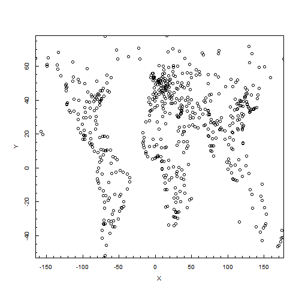
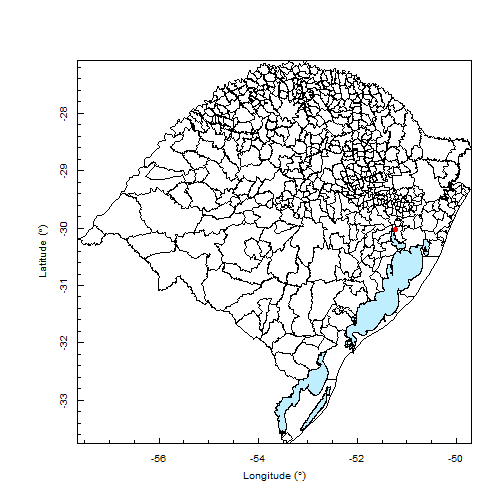

<<<<<<< HEAD


```r
> # How to plot Points?
> cities <- importShapefile('../../Data/cities', readDBF=FALSE);
> plotPoints(cities);
```

 

Data source: [Fundação Estadual de Proteção Ambiental Henrique Luiz Roessler - RS (fepam)](http://www.fepam.rs.gov.br/biblioteca/geo/bases_geo.asp)


```r
> library(PBSmapping);
> rsmunicipios <- importShapefile('../../Data/municipios_IBGE/Municipios_IBGE', readDBF=FALSE);
> plotMap(rsmunicipios);
> 
> rslagos <- importShapefile('../../Data/grandes_lagos_1_250000/Grandes_Lagos_1_250000', readDBF=FALSE);
> addPolys(rslagos, col="lightblue1");
> 
> # Create a data frame with the points coordinates
> pointCoordinates <- as.data.frame( cbind(1, -30.027879, -51.228467) );
> # Requirement: Rename the data frame columns (EID=unique identifier, Y=latitude e X=longitude)
> colnames(pointCoordinates) <- c("EID", "Y", "X");
> # Coerce the data frame to a EventData object, which is the standard object class of PBS Mapping functions
> PBSMappingCoordinates <- as.EventData( pointCoordinates, projection='LL');
> # Plot the points on the map (pch=point type, col=point color)
> addPoints(PBSMappingCoordinates, pch=19, col="red");
```

 


```r
> # How to calculate the Areas of Polygons
> polygonArea <- calcArea(rslagos, rollup=3);
```

```
Warning: To calculate the areas of polygons defined by longitude-latitude
coordinates, this routine first projects them in UTM.

For the UTM conversion, automatically detected zone 22.
```

```
convUL: Converting coordinates within the southern hemisphere.
```

```r
> head(polygonArea);
```

```
  PID SID      area
1   1   1   61.9691
2   2   1  801.4241
3   3   1 3847.6794
4   4   1 9488.2295
5   4   2  -40.9688
6   4   3   -0.9771
```


```r
> # How to convert lat-long coordinates to UTM?
> pointCoordinates <- as.data.frame( cbind(1, -30.027879, -51.228467) );
> colnames(pointCoordinates) <- c("EID", "Y", "X");
> latLongCoordinates <- as.EventData( pointCoordinates, projection='LL');
> # Convert coordinates
> aux <- convUL(latLongCoordinates);
```

```
convUL: For the UTM conversion, automatically detected zone 22.
convUL: Converting coordinates within the southern hemisphere.
```

```r
> print(aux);
```

```
  EID    Y   X
1   1 6678 478
```


```r
> # How to check an object class?
> rsmunicipios <- importShapefile('../../Data/municipios_IBGE/Municipios_IBGE', readDBF=FALSE);
> str(rsmunicipios);
```

```
Classes 'PolySet' and 'data.frame':	44917 obs. of  5 variables:
 $ PID: int  1 1 1 1 1 1 1 1 1 1 ...
 $ SID: int  1 1 1 1 1 1 1 1 1 1 ...
 $ POS: int  1 2 3 4 5 6 7 8 9 10 ...
 $ X  : num  -52.8 -52.8 -52.8 -52.8 -52.8 ...
 $ Y  : num  -29.4 -29.4 -29.4 -29.4 -29.4 ...
 - attr(*, "parent.child")= num  1 1 1 1 1 1 1 1 1 1 ...
 - attr(*, "shpType")= int 5
 - attr(*, "prj")= chr "GEOGCS[\"GCS_SIRGAS_2000\",DATUM[\"D_SIRGAS_2000\",SPHEROID[\"GRS_1980\",6378137.0,298.257222101]],PRIMEM[\"Greenwich\",0.0],UN"| __truncated__
 - attr(*, "xml")= chr  "<metadata xml:lang=\"en\"><Esri><CreaDate>20120927</CreaDate><CreaTime>09005200</CreaTime><SyncOnce>FALSE</SyncOnce><SyncDate>2"| __truncated__ "Datum atual do shapefile: SIRGAS2000 - Projetado por GEOFEPAM em 27/09/2012.</datacred><ptcontac><cntinfo><cntorgp><cntorg>GEOF"| __truncated__ "Datum atual do shapefile: SIRGAS2000 - Projetado por GEOFEPAM em 27/09/2012.</idCredit><searchKeys><keyword>Divisão Municipal "| __truncated__ "HBwgJC4nICIsIxwcKDcpLDAxNDQ0Hyc5PTgyPC4zNDL/2wBDAQkJCQwLDBgNDRgyIRwhMjIyMjIy" ...
 - attr(*, "projection")= chr "LL"
```

```r
> class(rsmunicipios);
```

```
[1] "PolySet"    "data.frame"
```


```r
> # How to convert a PBSmapping object to a SP object
> PBSMappingObject <- importShapefile('../../Data/grandes_lagos_1_250000/Grandes_Lagos_1_250000', readDBF=FALSE);
> class(PBSMappingObject);
```

```
[1] "PolySet"    "data.frame"
```

```r
> SPObject <- PolySet2SpatialPolygons(PBSMappingObject);
> class(SPObject);
```

```
[1] "SpatialPolygons"
attr(,"package")
[1] "sp"
```


```r
> # How to access a SP Polygon attribute?
> rslagos <- importShapefile('../../Data/grandes_lagos_1_250000/Grandes_Lagos_1_250000', readDBF=FALSE);
> rslagos <- PolySet2SpatialPolygons(rslagos);
> aux1 <- slot(rslagos, "polygons");
> aux2 <- rslagos@polygons;
```


```r
> # How to get the number of sub-polygons in a Polygon?
> rslagos <- importShapefile('../../Data/grandes_lagos_1_250000/Grandes_Lagos_1_250000', readDBF=FALSE);
> rslagos <- PolySet2SpatialPolygons(rslagos);
> length(rslagos@polygons);
```

```
[1] 6
```
=======


```r
> # How to plot Points?
> cities <- importShapefile('../../Data/cities', readDBF=FALSE);
```

```
Error: could not find function "importShapefile"
```

```r
> plotPoints(cities);
```

```
Error: could not find function "plotPoints"
```

Data source: [Fundação Estadual de Proteção Ambiental Henrique Luiz Roessler - RS (fepam)](http://www.fepam.rs.gov.br/biblioteca/geo/bases_geo.asp)


```r
> library(PBSmapping);
```

```
Error: there is no package called 'PBSmapping'
```

```r
> rsmunicipios <- importShapefile('../../Data/municipios_IBGE/Municipios_IBGE', readDBF=FALSE);
```

```
Error: could not find function "importShapefile"
```

```r
> plotMap(rsmunicipios);
```

```
Error: could not find function "plotMap"
```

```r
> rslagos <- importShapefile('../../Data/grandes_lagos_1_250000/Grandes_Lagos_1_250000', readDBF=FALSE);
```

```
Error: could not find function "importShapefile"
```

```r
> addPolys(rslagos, col="lightblue1");
```

```
Error: could not find function "addPolys"
```

```r
> # Create a data frame with the points coordinates
> pointCoordinates <- as.data.frame( cbind(1, -30.027879, -51.228467) );
> # Requirement: Rename the data frame columns (EID=unique identifier, Y=latitude e X=longitude)
> colnames(pointCoordinates) <- c("EID", "Y", "X");
> # Coerce the data frame to a EventData object, which is the standard object class of PBS Mapping functions
> PBSMappingCoordinates <- as.EventData( pointCoordinates, projection='LL');
```

```
Error: could not find function "as.EventData"
```

```r
> # Plot the points on the map (pch=point type, col=point color)
> addPoints(PBSMappingCoordinates, pch=19, col="red");
```

```
Error: could not find function "addPoints"
```


```r
> # How to calculate the Areas of Polygons
> polygonArea <- calcArea(rslagos, rollup=3);
```

```
Error: could not find function "calcArea"
```

```r
> head(polygonArea);
```

```
Error: object 'polygonArea' not found
```


```r
> # How to convert lat-long coordinates to UTM?
> pointCoordinates <- as.data.frame( cbind(1, -30.027879, -51.228467) );
> colnames(pointCoordinates) <- c("EID", "Y", "X");
> latLongCoordinates <- as.EventData( pointCoordinates, projection='LL');
```

```
Error: could not find function "as.EventData"
```

```r
> # Convert coordinates
> aux <- convUL(latLongCoordinates);
```

```
Error: could not find function "convUL"
```

```r
> print(aux);
```

```
Error: object 'aux' not found
```


```r
> # How to check an object class?
> rsmunicipios <- importShapefile('../../Data/municipios_IBGE/Municipios_IBGE', readDBF=FALSE);
```

```
Error: could not find function "importShapefile"
```

```r
> str(rsmunicipios);
```

```
Error: object 'rsmunicipios' not found
```

```r
> class(rsmunicipios);
```

```
Error: object 'rsmunicipios' not found
```


```r
> # How to convert a PBSmapping object to a SP object
> PBSMappingObject <- importShapefile('../../Data/grandes_lagos_1_250000/Grandes_Lagos_1_250000', readDBF=FALSE);
```

```
Error: could not find function "importShapefile"
```

```r
> class(PBSMappingObject);
```

```
Error: object 'PBSMappingObject' not found
```

```r
> SPObject <- PolySet2SpatialPolygons(PBSMappingObject);
```

```
Error: object 'PBSMappingObject' not found
```

```r
> class(SPObject);
```

```
Error: object 'SPObject' not found
```


```r
> # How to access a SP Polygon attribute?
> rslagos <- importShapefile('../../Data/grandes_lagos_1_250000/Grandes_Lagos_1_250000', readDBF=FALSE);
```

```
Error: could not find function "importShapefile"
```

```r
> rslagos <- PolySet2SpatialPolygons(rslagos);
```

```
Error: object 'rslagos' not found
```

```r
> aux1 <- slot(rslagos, "polygons");
```

```
Error: object 'rslagos' not found
```

```r
> aux2 <- rslagos@polygons;
```

```
Error: object 'rslagos' not found
```


```r
> # How to get the number of sub-polygons in a Polygon?
> rslagos <- importShapefile('../../Data/grandes_lagos_1_250000/Grandes_Lagos_1_250000', readDBF=FALSE);
```

```
Error: could not find function "importShapefile"
```

```r
> rslagos <- PolySet2SpatialPolygons(rslagos);
```

```
Error: object 'rslagos' not found
```

```r
> length(rslagos@polygons);
```

```
Error: object 'rslagos' not found
```
>>>>>>> origin/master
