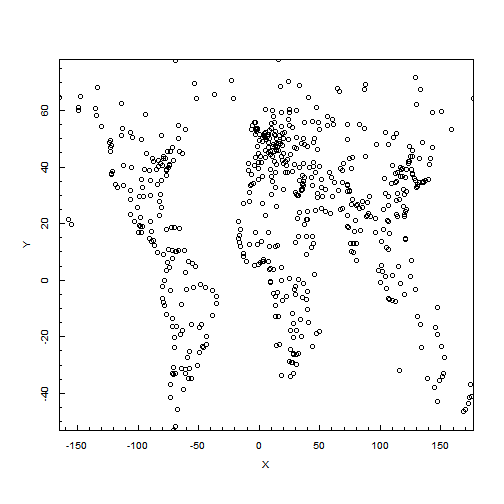
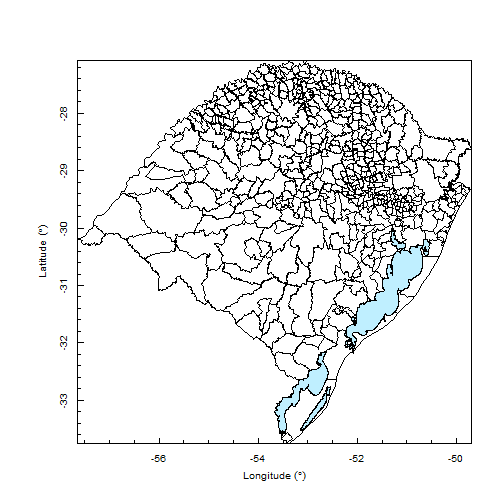

# Problem
You want to read a shapefile.

# Solution
The ``rgdal`` package has the function ``readOGR()`` to read shapefiles:

```r
> library(rgdal)
> cities <- readOGR('../../Data', 'cities')
```

```
OGR data source with driver: ESRI Shapefile 
Source: "../../Data", layer: "cities"
with 606 features and 4 fields
Feature type: wkbPoint with 2 dimensions
```
The ``maptools`` package also has functions to read shapefiles:

```r
> library(maptools)
> cities <- readShapeSpatial('../../Data/cities')
```
The ``PBSmapping`` package, which requires the ```maptools``, ``sp``, ``rgeos`` and ``foreign`` packages, also has functions to read shapefiles:

```r
> library(PBSmapping);
> library(maptools);
> library(sp);
> library(rgeos);
> library(foreign);
> cities <- importShapefile('../../Data/cities', readDBF=FALSE);
> plotPoints(cities);
```

 


```r
> # Transform geographic points in a dataframe to a EventData
> # as.EventData()
> 
> # Add points to a Map
> # addPoints()
> 
> # Calculate polygon area
> # calcArea()
> 
> # Get the class of an object
> # class()
> 
> # Convert lat-lon coordinates to UTM
> # convUL()
> 
> # Convert an PBSmapping object to a SP object
> # PolySet2SpatialPolygons()
> 
> # Access a SP polygon attribute
> # slot(<object>, "<attribute>")
> # <object>@<attribute>
> 
> # Get the number of SP subpolygons inside a SP polygon
> # length(<object>@<attribute>)
```


Data source: [Fundação Estadual de Proteção Ambiental Henrique Luiz Roessler - RS (fepam)](http://www.fepam.rs.gov.br/biblioteca/geo/bases_geo.asp)


```r
> library(PBSmapping);
> rsmunicipios <- importShapefile('../../Data/municipios_IBGE/Municipios_IBGE', readDBF=FALSE);
> plotMap(rsmunicipios);
> rslagos <- importShapefile('../../Data/grandes_lagos_1_250000/Grandes_Lagos_1_250000', readDBF=FALSE);
> addPolys(rslagos, col="lightblue1");
```

 


# Discussion
The Esri [shapefile](http://en.wikipedia.org/wiki/Shapefile), or simply a shapefile, is a popular geospatial vector data format for storing geometric location and associated attribute information. A shapefile is a set of files. Three individual files are mandatory to store the core data that comprise a shapefile: .shp, .shx, and .dbf. There are further optional files which store primarily index data to improve performance. All files should be located in the same folder.  

When using ``readOGR()`` to read ``cities.shp`` located at ``~/Data (windows: C:/Data)``, define the ``dsn`` argument as the path and the ``layer`` argument as the name of the file without extension. For example: ``readOGR('~/Data', "cities")``. If the shapefile is in the current working directory, an equivalent function call is: ``readOGR('.', "cities")``. See ``?readOGR`` for a detailed description of available arguments.  

With ``readShapeSpatial()``, use ``readShapeSpatial('~/Data/cities')`` to read ``cities.shp`` located at ``~/Data (windows: C:/Data)``. If the shapefile is in the current working directory, an equivalent function call is: ``readShapeSpatial('cities')``. The maptools package also has specific functions for each vector data type: ``readShapePoints()``, ``readShapePoly()`` and ``readShapeLines()``. ``readShapeSpatial()`` can be used instead of the previous three functions. See ``?readShapeSpatial`` for a detailed description of available arguments.  

# See also
XXX Draft XXX  
Classes and methods section for a description of the structure of created objects (in this case ``cities``).   


